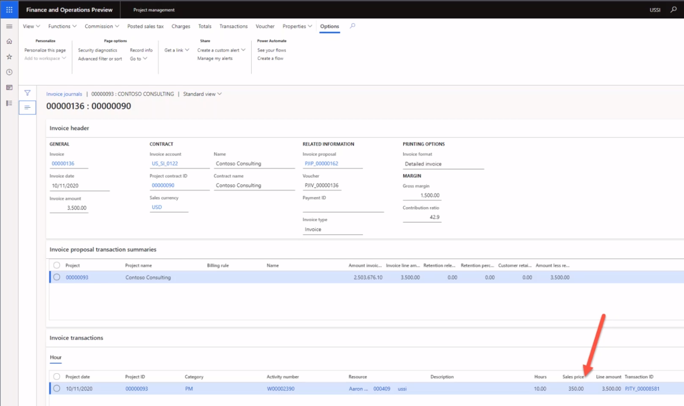
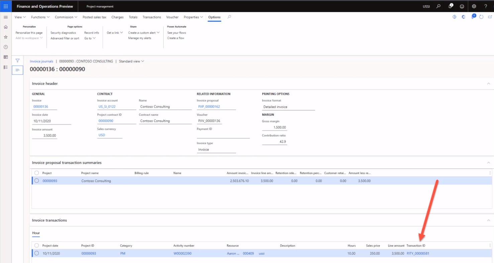

---
demo:
    title: 'Demo 1: Project Operations pricing'
    module: 'Module 5: Learn the Fundamentals of Microsoft Dynamics 365 Project Operations'
---

## Demo 1 - Project Operations pricing

1. Browse to the **Project management** workspace.  
    In this demo, we'll set up the sales and cost prices within project operations. And we'll see how cost and prices are derived from a previously posted invoice.

1. In the top-right company picker, verify the legal entity you are connected to is **USSI**.  
    If it's not, change the organization to **USSI**.

1. In the **Active projects** table, select project **00000093 Contoso Consulting**. This opens the project details view.

    

1. On the **Contoso Consulting** page, in the navigation bar, select the **Manage** tab.

1. In the **Manage** menu, select **Invoice journals**.  
    Here we've located an invoice where hours were applied.

1. Under **Invoice transactions**, in the **Sales price** column, point to **350.00**.  
    We can see in this view that the sales price for the resource Aaron Con, a project Manager for USSI, has a charge rate of 350 dollars. Let's review the pricing set up to see how that rate was determined.

      

    Although we can look at the prices from the individual project, we are going to start from the **Project management** workspace so we can see all pricing set up.

1. Browse to the **Project management** workspace.

1. On the right side of the screen, in the **Links** section, in the **Setup** submenu, select **Sales price (hour)**.

1. On the **Sales price – hour** page, in the **Pricing** column of the table, point to **350.00**.  
From this view, we can see where Aaron Con's sales price of 350 dollars was set up.

1. Point to the entire first row.  
    If we look across the entire row, we can see that Aaron is set up as a Project Manager and, more specifically, that the rate is associated to a specific project ID for Contoso Consulting.

1. In the **Resource** column, point to all other rows with resources assigned.  
    We can see within this table that there are other Project Managers also set up, but they're not allocated specifically to project IDs, and therefore their rates are only specific to the category and resources assigned.

      

    This matrix is flexible enough to support the level of detail we saw with Contoso Consulting and Aaron Con, as well as supporting a more generic pricing model such as the $300 price shown here.

1. For the Contoso Project, navigate to the **Invoice journals** page.  
    Going back to the posted invoice, we will look at that same posted hours transaction and review the costs associated Aaron Con by selecting the transaction ID on the invoice transaction line.

1. In the **Invoice transactions** section, select the **Hour** tab. In the table that appears, in the **Transaction ID** column, select a transaction ID.

    

1. On the **Hour transactions** page, select the **Overview** tab. In the table that appears, in the **Cost price** column, point to **200.00**.  
    From the hour transactions view, we can see the entry for Aaron Con and there's the associated cost price of $200. Let's go back and look at the cost price setup to see how that cost rate was derived.

1. Browse to the **Project management** workspace.

1. On the right side of the screen, in the **Links** section, in the **Setup** submenu, select **Cost price (hour)**.

1. On the **Cost price – hour Standard view** page, in the table, point to the row with **1/1/2014** in the **Effective date** column, **PM** in the **Category** column, **200.00** in the **Cost price** column, and no values in the other columns.  
    From this view I can see a cost price of $200 that has been set up specifically for the category of PM but there are no other lines that are specific to Aaron or our Contoso consulting project. This too is a common practice as many service organizations apply standard cost rates across categories, in this case identified here as a project role. This cost is often a blended rate where the individual resource pay rate will only be stored within the payroll or HR system. The standard cost rate will then be adjusted on a periodic basis as payroll costs are analyzed to ensure that they are accurate, and margins are being met.

    

1. Browse to the **Project management** workspace.

1. On the right side of the screen, in the **Links** section, in the **Setup** submenu, point to **Cost price (hour)** and **Sales price (hour)**.  

In this demonstration, we have explored how standard sales and cost prices are set up in Project Operations. We've reviewed their impact against a posted invoice to gain knowledge on how the setup of these prices directly impacts the time and material invoice presented.
