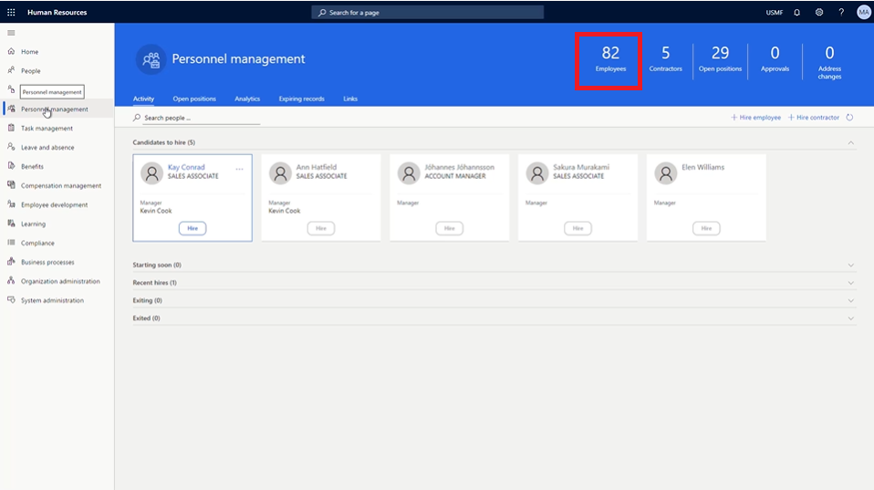

---
demo:
    title: 'Demo 1: Assigning Learning Courses'
    module: 'Module 4: Learn the Fundamentals of Microsoft Dynamics 365 Human Resources'
---

## Demo 1 - Assigning Learning Courses

1. Browse to the **Microsoft Dynamics 365 Human Resources** home page.  
    In Microsoft Dynamics 365 Human Resources, personnel managers can assign training courses to employees. In this example, the company’s new hire, Alicia, needs to be assigned the training that is available to employees within their first thirty days.

1. In the top-right company picker, verify that the company you are connecting to is **USMF**. If it’s not, change it to **USMF**.

1. In the upper-left corner of the screen, select the **Personnel management** tab.

1. On the right side of the **Personnel management** page, click the number directly above the word **Employees**.

    

1. In the **Employees** table, select the name of the employee to assign training to. For example, **Alicia Thornber**.  
    Next, use the Competencies and development tab to see links to information about an employee’s certificates, education, and skills.

1. On the employee page, select the **Competencies and development** tab.

1. In the **Competencies** section, select **Courses**.  
    From an employee’s Courses page, you can see whether any courses have been assigned. In Alicia’s case, no courses are listed. To view available courses to assign, you need to select the Course ID menu.

1. Select the **Course ID** menu.

1. In the Courses table, select the **Course ID** menu.

1. In the **Course ID** menu, select the **Couse status** menu.

1. In the **Course status** menu, select the **Course status is exactly** box.  
    You may then need to edit the **Course ID** filter that is being applied, such as changing the filter to display only open courses.

1. In the **Course status is exactly** box, enter **Open**.

1. In the **Course status** menu, select **Apply** to see all the available open courses.  
    Now, you can assign the new hire training course to Alicia.

1. Select the course you would like to assign. For example, **00006 New Hire Training**.

1. In the Transfer course data pane, select **Yes**.

1. On the **Courses** page, in the **Start date** column, select the **calendar icon**.

1. In the calendar, select the start date. For example, **January 5th 2021**.

1. In the **End date** column, select the **calendar icon**.

1. In the calendar, select the end date for the training. For example, **January 8th 2021**.

1. On the left side of the **Courses** page, select **Save** to save your changes.

1. On the right side of the **Courses** page, select the **X** to close the page.  
    If you need to change any assigned courses, select Courses again.

1. On the **employee** page, in the **Competencies** section, select **Courses**.

1. On the **Courses** page, in the navigation bar, select **Edit** to make changes.

1. In the **Start date** column, select the **calendar icon**.

1. Select the new start date for the course. For example, **January 6th 2021**.

1. Select **Save**.

1. Select the **X** icon to close the page.

1. On the **employee** page, select the **X** icon to close the page.
