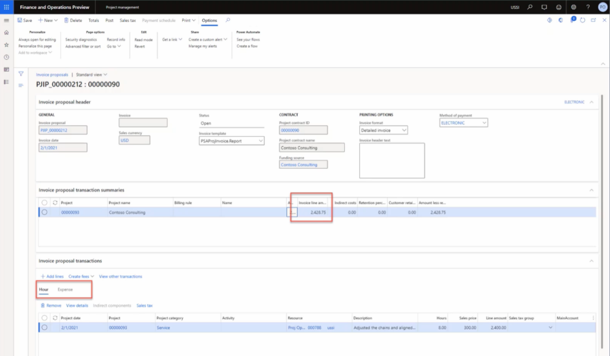
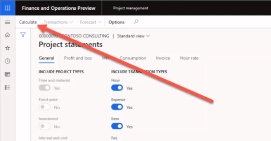

---
demo:
    title: 'Demo 2: Create an invoice'
    module: 'Module 5: Learn the Fundamentals of Microsoft Dynamics 365 Project Operations'
---

## Demo 2 - Create an invoice

1. Browse to the **Project management** workspace.  
    In this demo, we'll go over the process of invoicing a single project within project operations. Although it's possible to perform mass invoicing, for demonstration purposes we will focus on just a single time and material project. We'll also see the posting results and financial insights within the project statement. Let's start with project invoicing. 

1. In the top-right company picker, verify the legal entity you are connected to is **USSI**. If it's not, change the legal entity to **USSI**.  
    From the **Project management** workspace, we can see all the active projects. We can search for projects using the filter, or in this example, we will select a known Project ID. 

1. In the **Active projects** table, in the **Project ID** column, select **00000093 Contoso Consulting**.  

1. Next, open the **Project invoice proposals** page to view all previous invoices processed for Contoso Consulting. 

1. In the action pane, in the **BILL** tab, select **Project invoice proposals**. 

1. On the **Project invoice proposals** page, in the navigation bar, select **New**, then **Invoice proposal**.  
    This is a simple time and material invoice, so we don't need to select the option for Invoice proposal from billing rule. 

    

1. In the **Create invoice proposal** pane, point to the boxes under **Select transactions**.  
    From here, we can select things such as the invoicing method, the invoice date, the funding source, and the project. We can also choose to include sub projects, as well as incorporate transaction types, the start and end dates for transactions, and any financial dimensions we need. 

    

1. From the **Project** drop-down menu, select **00000093 Contoso Consulting**. 

1. For this example, ensure that the **Invoice date** is set to **2/1/21**, the **Start date** is set to **2/1/21**, and the end date is today's date.  
    Once the selections are made, select the search button to find the transactions meeting those parameters.

1. Select **Search**.  
    Next, to invoice all the transactions, select the Select all option. This will select the items we choose for expenses and hours.

1. Under the **Project transactions** tab, select **Select all**.

1. Select **OK**. 

1. On the **Invoice proposal** page, point to the **Invoice line amount** column.  
    Here we can see the invoice amount and summary, hours transactions, and expenses.

    

1. Point to the **Hour** tab. 

1. Point to the **Expense** tab.  
    You can also switch and look at the expense transaction.  
Next, let's check the totals button to see what the invoice will look like from both a cost and revenue perspective.

1. In the navigation bar, select **Totals**.

1. On the **Totals** page, point to the **GENERAL LEDGER** column, the **CUSTOMER** column, and the **Line discount column**.  
    On the totals screen, we can see what the impact will be on the general ledger, any customer information such as credit limits, any discounts, sales taxes, and the net impact of the invoice. 

1. On the right side of the screen, select **X** to close the page.  
    We are now ready to create a print preview to ensure that all invoicing information is accurate. Some organizations use the preview during project review meetings to ensure that everyone agrees with the totals before the invoice is finalized. 

1. On the **Invoice proposal** page, in the navigation bar, select **Print preview**. 

1. In the dialogue box, select **Print preview**.  
    Here you can see an example of print preview for a Pro forma invoice. 

1. Select **X** to close the page.  
    Once we've validated all the information and are happy with the Print preview of the invoice, we can post the invoice proposal.

1. In the navigation bar, select **Post**.

1. Select the **Parameters** tab.

1. Under **PARAMETER**, set **Posting** to **Yes**.

1. Under **PRINT OPTIONS**, set **Print invoice** to **Yes**.

1. Select **OK**.

1. On the **Invoice** page, point to the **Invoice** number.  
    Now we have an invoice number that has been generated.  
    Once the invoice has been posted, we are able to review the information in the invoice journal and drill down to the ledger transactions.

1. Browse to the **Project management** workspace.

1. In the **Active projects** table, select project **00000093** **Contoso consulting**.

1. In the action pane, in the **BILL** tab, select **Invoice journals**.

1. On the **Invoice journal** page, in the action bar, select **Voucher**.

1. On the **Voucher transactions** page, point to the **Ledger account** column.  
    Here we see results posted to the general ledger. The general ledger accounts are determined by the account setup and the financial dimensions applied to each project.

1. Browse to the **Project management** workspace. 

1. In the **Active projects** table, select the **00000093 Contoso Consulting project**.

1. On the **Contoso Consulting** page, in the navigation bar, select **Control**.  
    From here we can see all the project details.  
    Next, let's look at the project financials on a project statement.

1. Select **Project statements**.

1. On the **Project statements** page, point to the **PROJECT DATE** section.  
You can create a statement for any date range you like.

1. Select the **From** date box and enter **2/1/2021**.
1. 
1. Select the **To date** box and enter today's date.

1. When complete, select **Calculate**.

    

1. Point to **Transactions**.  
    Once the data has refreshed, a project manager can choose to drill down further into the transactional details to make project decisions or make adjustments as necessary. In this demonstration, we have processed a time and material invoice with both an hour and expense transaction. We looked at it in preview, then posted the invoice, reviewed the ledger posting, and finally reviewed the financial impact through this project statement.
