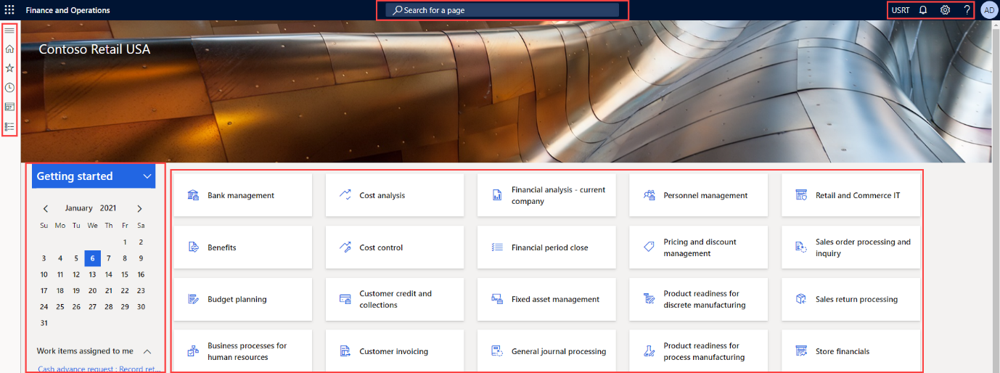
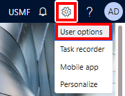
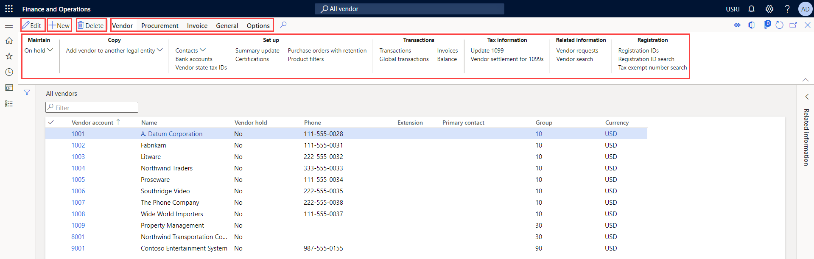
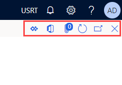

---
lab:
    title: 'Lab 1: Navigate finance and operations apps'
    module: 'Module 1: Explore the core capabilities of Dynamics 365 finance and operations apps'
---

# Module 1: Explore the core capabilities of Dynamics 365 finance and operations apps

## Lab 1: Navigate finance and operations apps

## Objective

Now that you've become familiar with finance and operations apps, take some time to explore the interface.

## Lab Setup

- **Estimated Time**: 10 minutes

## Instructions

### Sign in to the Lab computer

1.  Sign in to the lab computer using below credentials:

    - User Name: `Administrator`

    - Password: `pass@word1`

1.  Wait for the AdminUserProvisioning script to finish before continuing. This may take 2-3 minutes. Once the script is completed a pop-up box will briefly display to confirm the Admin user has been successfully updated. 

1.  **Microsoft Edge** will open the Finance & Operations URL: <https://usnconeboxax1aos.cloud.onebox.dynamics.com>

1.  Sign in using the Username and Password provided in the **Resources** menu. 

### Navigate finance and operations apps

Now that you have become familiar with finance and operations apps, take some time to explore the interfaces.

1. On the **Finance and Operations Home** page, if configured, you find:

	- The navigation menu on the left that is collapsed by default.

	- Your company's logo.

	- Workspace tiles available to you based on your role in the organization.

	- A calendar and work items assigned to you.

	- The Search bar that is useful to quickly find what you need.

	- In the top right, you have the company you're currently working with, notifications, settings, and help links. Verify the company listed is **USMF**.

2. In the top left, select the **Expand the navigation pane** hamburger menu.

3. The navigation pane is where you find collections for your **Favorites**, **Recent** items, **Workspaces**, and **Modules**.

4. In the navigation pane, select **Modules** > **System administration**.

5. Review the areas available in the System administration module.

6. Under **Setup**, select **Client performance options**.

7. In the **Client performance options** pane, under **Feature callouts enabled**, select the toggle switch and ensure that it's set to **Yes**.

8. Review the other available options, scroll to the bottom of the pane, and then select **OK**.

9. On the **Home** page, in the top right, select the **Settings** icon, and then select **User options**.

10. On the **Options** page, use the tabs to configure different settings that apply to your account.

11. Select the **Preferences** tab.

12. Review the available preferences. Notice you can change the default company and initial page view when you sign in.

13. Select and review the **Account** and **Workflow** tabs.

14. In the left navigation menu, select the **Home** icon.

15. On the **Home** page, in the top center of the page, select the **Search for a page** box.

16. In the search box, search for **All vendors**.

17. Select **All vendors** Accounts payable > Vendors

18. You may need to wait the first time you search for a page. There's a small spinning circle to the right of the search box while the search is processing.

19. The **All vendors** page is an example of a list page. The list page contains master data that can be read, created, deleted, and updated. There are more features using the ribbon above the list.

20. Highlight one of the vendors from the list and, on the right, select the **Related information** menu, and review the additional information that is provided.

21. In the vendor list, select **Acme Office Supplies**.

22. Select the **Group** menu, and then select the **Vendor group** column title.

23. Many menus have sorting and filtering available. Use the filters to quickly locate the field content you're looking for.

24. In the top right, notice the extra functionality. Move your mouse to each item, and review the feature callout. When complete, select the **Close** icon to close the page and return to the **Home** page.

25. In the upper-right, select the **Help** question mark icon, and then select **Help**.

26. Notice the help information is related to the current page.

27. Try selecting a workspace tile, and then review the help information for that workspace. When complete, return to the **Home** page.

