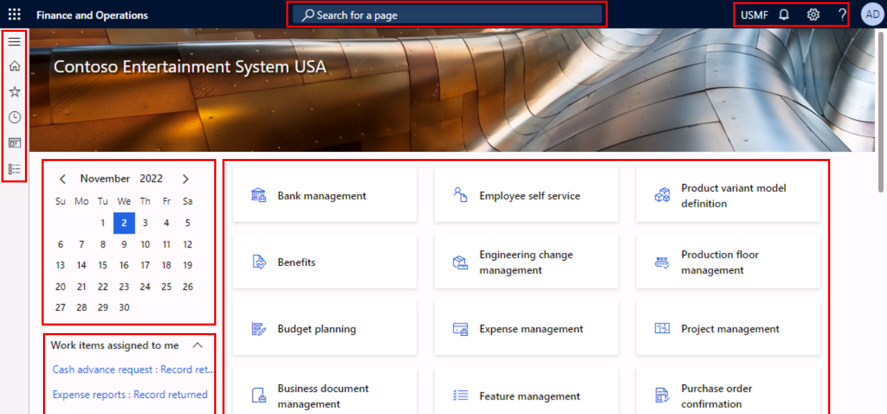
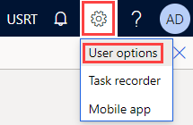
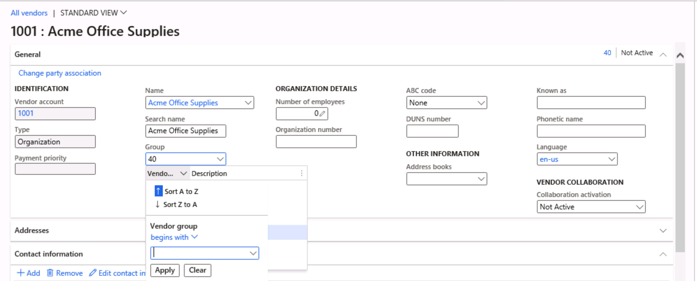
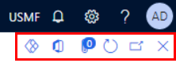

---
lab:
    title: 'Lab 1: Navigate finance and operations apps'
    module: 'Module 1: Explore the core capabilities of Dynamics 365 finance and operations apps'
---

# Module 1: Explore the core capabilities of Dynamics 365 finance and operations apps

## Lab 1 - Navigate finance and operations apps

## Objectives

Now that you've become familiar with finance and operations apps, take some time to explore the interface.

## Lab Setup

- **Estimated Time**: 10 minutes

## Instructions

### Sign in to the Lab computer

1.  Sign in to the lab computer using below credentials:

    - User Name:

    `Administrator`

    - Password:

    `pass@word1`

1.  Wait for the AdminUserProvisioning script to finish before continuing. This may take 2-3 minutes. Once the script is completed a pop-up box will briefly display to confirm the Admin user has been successfully updated. 

1.  **Microsoft Edge** will open the Finance & Operations URL: <https://usnconeboxax1aos.cloud.onebox.dynamics.com>

1.  Sign in using the Username and Password provided in the **Resources** menu. 

### Navigate finance and operations apps

1.  On the **Finance and Operations Home** page, you will see: 

    - The navigation menu on the left that is collapsed by default. 

    - The company's default banner image. 

    - Workspace tiles available to you based on your role in the organization. 

    - A calendar and work items assigned to you. 

    - The **Search for a page** bar that is very useful to quickly find what you need. 

    - In the top right, you have the company you are currently working with, notifications, settings, and help links. 

    

1.  Verify the company listed is **USMF**. 

1.  In the top left, select the **Expand the navigation pane** hamburger menu. 

1.  The navigation pane is where you'll find collections for your **Favorites**, **Recent** items, **Workspaces**, and **Modules**. 

1.  In the navigation pane, select **Modules** > **System administration**. 

1.  **Review** the different areas available in the **System administration** module. 

1.  Under **Setup**, select **Client performance options**. 

1.  In the Client performance options pane, under **Feature callouts enabled**, select the toggle switch and ensure that it is set to **Yes**. 

1.  Review the other available options, scroll to the bottom of the pane, and select **OK**. 

1.  On the Home page, in the top right, select the **Settings** icon, and then select **User options**. 

    

1.  On the **User options** page, use the tabs to configure different settings that will apply to your account. 

1.  Select the **Preferences** tab. 

1.  Review the available preferences. Notice you can change the default **Company** and **Initial page** you will see when you sign in. 

1.  Select and review the **Account** and **Workflow** tabs. 

1.  In the left navigation menu, select the **Home** icon. 

1.  On the Home page, in the top center of the page, select the **Search for a page** box. 

1.  In the search box, search for `All vendors` 

1.  You may need to wait the first time you search for a page. You will see a small spinning circle to the right of the search box while the search is processing. 

1.  Select the first result **All vendors**, this is the same as navigating to **Modules** > **Accounts payable** > **Vendors** > **All vendors**. 

1.  The **All vendors** page is an example of a list page. The list page generally contains master data that can be read, created, deleted, and updated. You'll see additional functions available using the action pane above the list. 

    

1.  Highlight one of the vendors from the list and, on the right, select the **Related information** FactBox pane on the right, and review the additional information that is provided. 

1.  In the vendor list, open the **Acme Office Supplies** record. 

1.  Select **Edit** in the action pane, then in the **Group** field, select the drop-down menu and then select the **Vendor group** column title. 

    

1.  Many menus have **sorting** and **filtering** available. Use the filters to quickly locate the field content you are looking for. If you already know the value, you can simply enter it into the field, rather than using the drop-down menu. 

1.  In the right of the action pane, notice the additional functionality. Hover over each item, and review the feature callout. 

1.  Select the **Close** icon to close this record and return to the **All vendors** list page. 

    

1.  In the upper-right, select the **?** Question mark icon, and then select **Help**. 

1.  Notice the help information pane is showing content for the current page. **Close** the Help pane. 

1.  Return to the **Default dashboard** using the **Finance and Operations** button in the very top left, or the **Home** icon in the left hand navigation menu. 

    > **Note:** Keyboard shortcut: Alt+Shift+Home. Dynamics 365 Finance and Operations supports a lot of keyboard shortcuts to speed up accessing the system: https://learn.microsoft.com/en-us/dynamics365/fin-ops-core/fin-ops/get-started/shortcut-keys

1.  Try selecting a **Workspace tile**, and then review the help information for that Workspace. When complete, return to the Default dashboard. 

