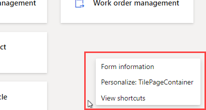
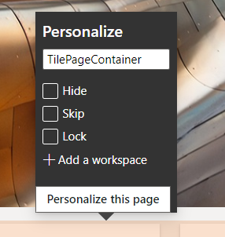
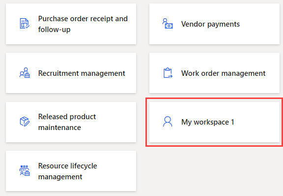
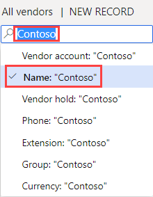
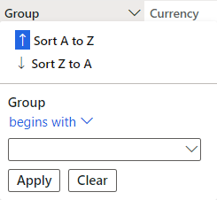
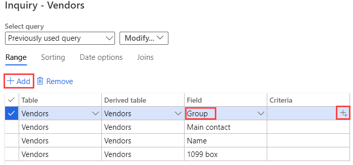

---
lab:
    title: 'Lab 2: Explore workspaces and filtering'
    module: 'Module 1: Learn the Fundamentals of Microsoft Dynamics 365 Supply Chain Management'
---

# Module 1: Learn the Fundamentals of Microsoft Dynamics 365 Supply Chain Management

## Lab 2 - Explore workspaces and filtering

## Objectives

Many built-in workspaces are available to you when you first sign in to Finance and Operations. You can also create your own workspace with content focused on a need you may have. Workspaces are one of the many features of Dynamics 365, but you should also be aware that filtering is the way to really get to the specific items you may be looking for. You must create a new personalized workspace and use filtering to identify different items you need.

## Lab Setup

    - **Estimated Time**: 10 minutes

## Instructions

1. On the Finance and Operations Home page, to the right of the workspace tiles, right-click or tap and hold in a blank area to trigger the menu.

    

1. In the menu, select **Personalize: TilePageContainer**.

1. In the Personalize window, select **+ Add a workspace**.

1. If the small Personalize window is not visible, try scrolling up on the Home page and right-click or tap and hold, and then select **Personalize: TilePageContainer** again.

    

1. On the Home page, scroll down and locate the new **My workspace 1** tile.

    

1. Right-click or tap and hold the tile, and then select **Personalize: My workspace 1**.

1. In the Personalize window, rename My workspace 1 to **My workspace,** and then select **Personalize this page**.

1. The name change will be saved automatically.

1. In the newly opened toolbar, select **Move**.

    

1. Select your **My workspace** tile and then move it to another location on the Home page.

1. Close the toolbar.

1. On the Home page, in the **Search for a page** box, search for and select **All vendors**.

1. On the All vendors page, in the top menu, select **Options** > **Add to workspace**.

1. In the **Workspace** filter box, enter **My workspace,** and then select the workspace.

1. Select the Presentation menu, review the available options, and then select **Tile**.

1. When complete, select **Configure**.

1. In the Add as tile pane, verify the tile name, and then select **OK**.

1. In the left navigation pane, select the **Home** icon.

1. On the Home page, select your new workspace.

1. On the My workspace page, verify the newly added Vendors tile is shown.

1. Select the **Vendors** tile.

1. On the All vendors page, in the **Filter** box, enter **Contoso**.

1. Review the different fields that can be used to find Contoso.

    

1. Select **Name: "Contoso"** and then verify the filter results.

1. Clear the filter box, and then press enter to show all vendors.

1. Select the column title **Group**.

    

1. You can use this to sort the groups by lowest to highest (Sort A to Z) or highest to lowest (Sort Z to A).

1. Under **Group**, select the **begins with** menu and review the comparison operators. Select **is exactly**.

1. Select the menu below **is exactly,** and then select **30 Other Vendors**.

1. Alternatively, you could enter a value in the menu field.

1. Select **Apply**, and then review the results. Notice the filter icon in the Group column header.

    

1. Select the **Group** column and then, in the filter menu, select **Clear**.

1. To the left of the All vendors title, select the Filter icon.

    

1. In the top right of the Filter pane, select **+ Add**.

1. In the Add filter fields pane, select the checkbox to the left of **Group,** and then select Update.

1. Notice the additional filter that has been added. This will allow you to filter the list based on more than one criterion.

    

1. In the **Vendor account begins with** filter, select the menu, and then select **Northwind Traders**.

1. In the **Group begins with** filter, select the menu, and then select **30**.

1. Select **Apply,** and then review the filter results.

1. In the Filters pane, select **Reset** and notice that the additional filter has been removed and the default filter has been reset to an empty value.

1. On the ribbon bar, select **Options** and then, in the Page options sections, select **Advanced filter or sort**.

    

1. In the Inquiry - Vendors window, select **+ Add**.

1. In the new row, in the Field cell, select the menu, and then select **Group**.

1. Alternatively, you can select the menu, start typing the name of the group, and then select it from the results of the filter.

1. In the Criteria cell, select the **Open** icon.

    

1. In the Vendor group list, select **30 Other Vendors**.

1. To save the new query, under **Select query**, select the **Modify** menu, and then select **Save as**.

    

1. In the Save query pane, in the **Name** box, enter My query, and then select **OK**.

1. On the Inquiry - Vendors page, select **OK**.

1. Verify the list reflects the results of the newly created query.

1. To remove the filter, select **Advanced filter or sort** and then, on the Inquiry - Vendors page, select **Reset** and then select **OK**.

1. This will reset the query but will not delete your saved query.
