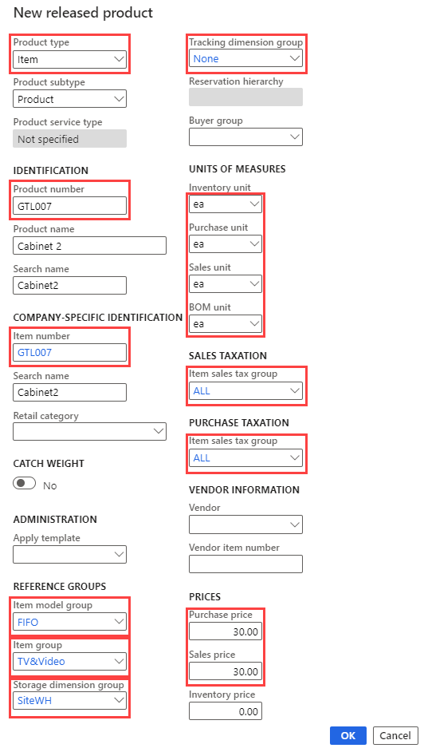
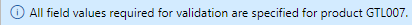

---
lab:
    title: 'Lab 3: Create a product offering with various sizes and colors'
    module: 'Module 1: Learn the Fundamentals of Microsoft Dynamics 365 Supply Chain Management'
---

# Module 1: Learn the Fundamentals of Microsoft Dynamics 365 Supply Chain Management

## Lab 3 - Create a new product

## Objectives

In Contoso Entertainment System USA (USMF), you need to create a new item for a new configuration of cabinet to be purchased from vendors.

## Lab Setup

   - **Estimated Time**: 10 minutes

## Instructions

1. On the Finance and Operations Home page, in the top right, verify you are working with the USMF company.

1. If necessary, select the company and from the menu, select **USMF**.

1. In the top left, select the **Expand the navigation pane** hamburger menu.

1. In the navigation pane, select **Modules** > **Product information management,** and then under the **Products** category, select **Released products**.

1. On the Released product details page, on the top menu, select **+ New**.

1. In the New released product pane, in the **Product type** menu, verify **Item** is selected.

1. In the **Product subtype** menu, verify **Product** is selected.

1. Select the **Tracking dimension group** menu, and then select **None**.

1. Under **IDENTIFICATION**, in the **Product number** and **Item number** boxes, enter **GTL007**.

1. In the **Product name** box, enter **Cabinet 2**.

1. Under **REFERENCE GROUPS**, select the **Item model group** menu, and then select **FIFO First In-First Out**.

1. Select the **Item group** menu and then select **TV&Video**.

1. Select the **Storage dimension group** menu, and then select **SiteWH**.

1. Under **UNITS OF MEASURES**, verify the following values are set:

    | **Setting**| **Value**|
    | :--- | :--- |
    | Inventory unit| ea Each|
    | Purchase unit| ea Each|
    | Sales unit| ea Each|
    | BOM unit| ea Each|

1. Under **SALES TAXATION**, select the **Item sales tax group** menu, and then select **ALL**.

1. Under **PURCHASE TAXATION**, select **Item sales tax group** menu, and then select **ALL**.

1. Under PRICES, in the Purchase price box, enter 30.00.

1. In the Sales price box, enter 30.00.

1. Your new release product should look like this:

    

1. Select **OK**.

1. To ensure the product is finalized, in the ribbon bar, under **Maintain**, select **Validate**.

    

1. Verify you are presented with the information banner confirming that all field values required were validated.

    

1. Close all pages and return to the Home page.
