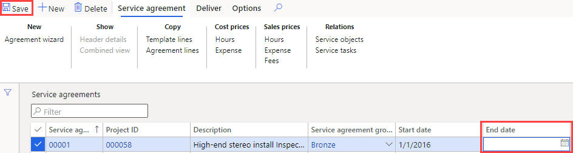

---
lab:
    title: 'Lab 7: Create a planned work order'
    module: 'Module 1: Learn the Fundamentals of Microsoft Dynamics 365 Supply Chain Management'
---

## Lab 7 - Create a planned work order

## Objectives

Maintenance orders placed in the system describe the maintenance or repair that is needed on an asset and are used to assign the appropriate resources to complete the maintenance request. Your company has an ongoing service contract and needs to be sure that planned service orders are created to support expected servicing of contract items.

## Lab Setup

   - **Estimated Time**: 10 minutes

## Instructions

1. On the Finance and Operations Home page, in the top right, verify you are working with the USMF company.

1. If necessary, select the company and from the menu, select **USMF.**

1. In the left navigation pane, select **Modules** > **Service management** > **Service agreements** > **Service agreements**.

1. Select the check box in the first column of the first service agreement.

    

1. Select the **End date** box and delete the current value, and then, on the top menu, select **Save**.  
 The end date is being removed so that a new service order can be created for this agreement.

    

1. On the top menu, select **Deliver**.

1. On the ribbon bar, under **Create**, select **Planned service orders**.

1. In the Create service orders pane, under **PERIOD**, set the **From date** to today's date and the **To date** to two days from today's date.

1. Under **INFOLOG**, select **Show Infolog** toggle switch to set it to **Yes**.  
This will display a list of the service orders that are created in the agreement.

1. Under **INCLUDE TRANSACTION TYPES**, select the **Hour** toggle switch to set it to **Yes**.  
The transaction types represent the lines that are created in the service agreement, and each transaction type that you select generates several service orders, depending on the service interval that is specified on the service agreement line.

1. Under **OPTION**, select the **Continuous** toggle switch to set it to **Yes**.  
This is used to create any service orders that are missing from a continuous series of service orders.

1. Select **OK**.
