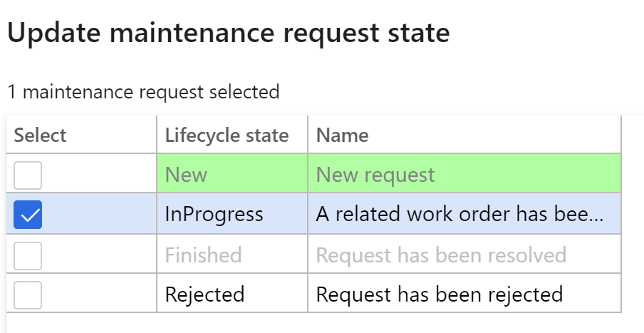
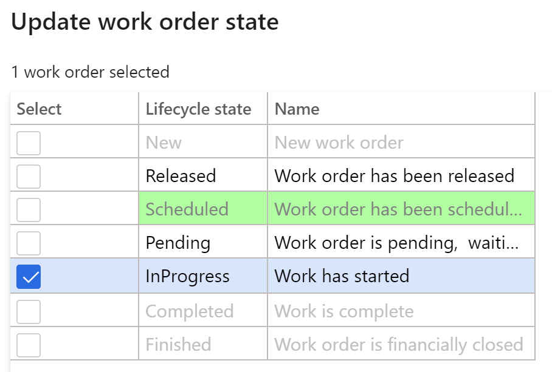
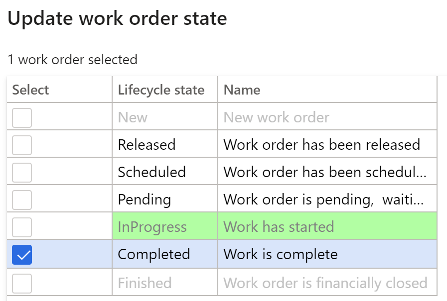

---
lab:
    title: 'Lab 7: Create a maintenance work order'
    module: 'Module 1: Learn the Fundamentals of Microsoft Dynamics 365 Supply Chain Management'
---

## Lab 7 - Create a maintenance work order

**Objectives**

Maintenance orders placed in the system describe the maintenance or repair needed for an asset and are used to assign the appropriate resources to complete the maintenance request. The Work Order is created based on the maintenance order, which is executed by the resource allocated.

**Lab Setup**

Estimated time: 15 mins.

**Instructions**

1. On the Finance and Operations Home page, in the top right, verify you are working with the USMF company.

2. If necessary, select the company and from the menu, select **USMF**.

3. In the left navigation pane, select **Modules** **&gt; Asset Management &gt; Setup &gt; Maintenance Request &gt; Lifecycle states.**

4. Select InProgress and click on the **Edit** button in the action pane.

5. Under the **General** tab, change the **Create Work Order** value to Yes.

6. In the left navigation pane, select **Modules** **&gt; Asset Management &gt; Workspaces &gt; Maintenance request management.**

7. Click on **Create maintenance request.**

8. Enter following values in the fields of the dialog and click on the **OK** button.

	- Maintenance request type: Corrective

	- Description: Noise in the metal detector

	- Functional location: PP-02-02

	- Asset: MD-201

	- Service level: 4

	- Fault symptom: Excessive noise

	- Fault area: Electrical 

9. Close the **Maintenance request** form and go back to the **Maintenance request management** workspace.

10. Refresh the page by pressing the **refresh** icon at the top-right corner of the screen.

11. The new Maintenance request will appear in the list of Maintenance requests without work order.

12. Select the newly created the Maintenance request and click on the **Update maintenance request state** button. 

13. In the dialog select the checkbox next to InProgress and click on **OK**

 

14. Select the newly created the Maintenance request and click on the **Create work order** button. 

15. Enter following values in the fields of the dialog and click on the **OK** button.

	- Maintenance job type: Inspection

16. A new work order will be created, and the work order will be updated in the selected Maintenance request record.

17. Click on the work order and navigate to the **Work order details** screen.

18. Under the work order Lines, click on the **Dispatch** button.

19. Enter following values in the fields of the dialog and click on the **OK** button.

	- Worker: Ted Howard

20. In the Action menu, navigate to **Work order &gt; Lifecycle state &gt; Update work order state.**

21. In the dialog select the checkbox next to InProgress and click on **OK**

22. Select the **Actual start** date & time in the dialog box and click on **OK.**

23. From the Work Order action menu, again navigate to **Work order &gt; Lifecycle state &gt; Update work order state.**

24. In the dialog select the checkbox next to Completed and click on **OK**

25. In the **Actual end** field select a date & time which is greater than start date & time and click on OK

26. You will find the current lifecycle state in the work order header as completed.
