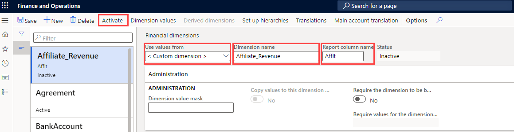
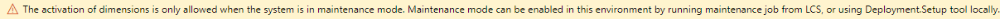

---
lab:
    title: 'Lab 1: Create a financial dimension'
    module: 'Module 2: Learn the Fundamentals of Microsoft Dynamics 365 Finance'
---

## Lab 1 - Create a financial dimension

## Objectives

Use the Financial dimensions page to create financial dimensions that you can use as account segments for charts of accounts. There are two types of financial dimensions: custom dimensions and entity-backed dimensions. Custom dimensions are shared across legal entities, and the values are entered and maintained by users. For entity-backed dimensions, the values are defined somewhere else in the system, such as in Customers or Stores entities. Some entity-backed dimensions are shared across legal entities, whereas other entity-backed dimensions are company-specific.

You must create a custom financial dimension that will be used by your company.

## Lab Setup

   - **Estimated Time**: 5 minutes

## Instructions

1. On the Finance and Operations Home page, in the top right, verify you are working with the USMF company.

1. If necessary, select the company, and from the menu, select **USMF**.

1. In the left navigation pane, select **Modules** > **General ledger** > **Chart of accounts** > **Dimensions** > **Financial dimensions**.

1. On the top menu, select **+ New**.

1. On the Financial dimensions page, select the **Use values from** menu, and then select **< Custom dimension >**.

1. In the **Dimension** name box, enter **Affliate_Revenue**.

1. In the **Report column name** box, enter **Afflt**.

1. In the top menu, select **Activate**.

    

1. Review the information in the dialog box, and then select **Close**.

1. Review the warning notification banner.

    

    >[!NOTE] Maintenance mode can be turned on and off directly through Lifecycle Services (LCS) on your sandbox and production environments. More information about managing lifecycle services can be found at [https://docs.microsoft.com/en-us/dynamics365/fin-ops-core/dev-itpro/deployment/maintenanceoperationsguide-newinfrastructure](https://docs.microsoft.com/en-us/dynamics365/fin-ops-core/dev-itpro/deployment/maintenanceoperationsguide-newinfrastructure).
