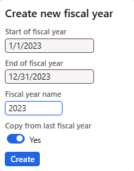
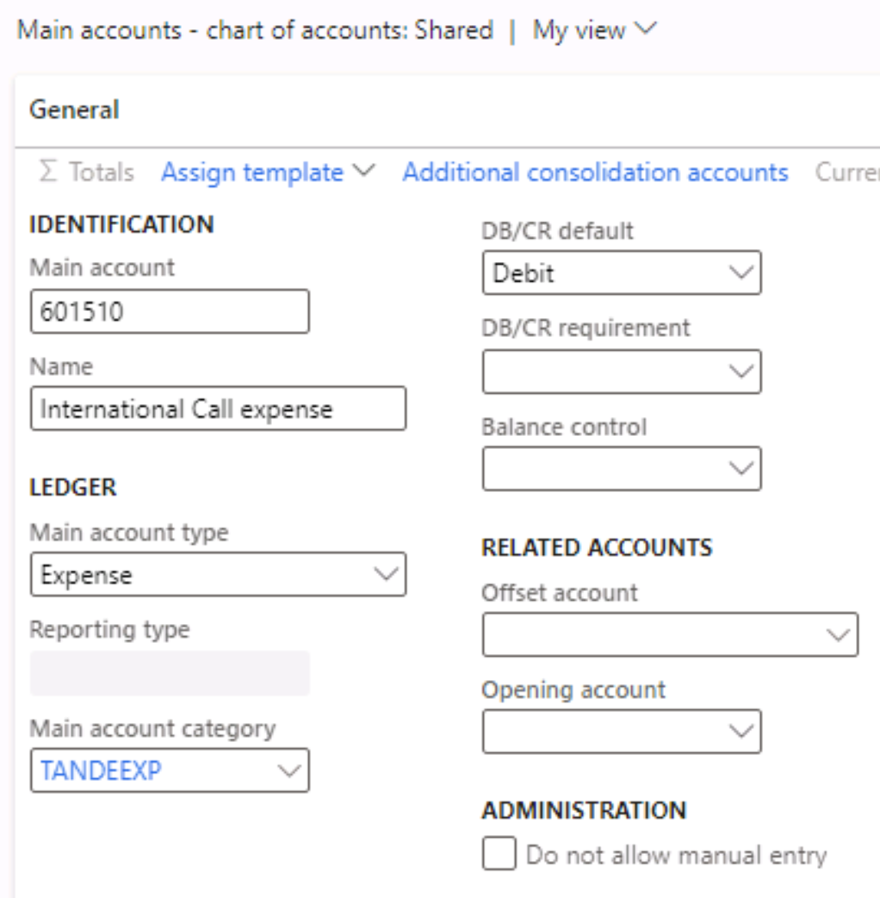

---
lab:
    title: 'Lab 1: Create a main account'
    module: 'Module 2: Learn the Fundamentals of Microsoft Dynamics 365 Finance'
---

# Module 2: Learn the Fundamentals of Microsoft Dynamics 365 Finance

## Lab 1: Create a main account

## Lab Setup

   - **Estimated Time**: 5 minutes

## Instructions

1.  On the **Finance and Operations Home** page, in the upper right, verify you're working with the **USMF** company.

2.  If necessary, select the company, and from the menu, select **USMF**.
3.  In the left navigation pane, select **Modules > General ledger > Calendars > Fiscal calendars**.
4.  Select Calendar **Fiscal**
5.  If the current calendar year is already created, exit the **Fiscal calendars** page.
6. If the current calendar year is not created, select the **New year** button in the action pane and enter the current year as it appears in the following screenshot. Select the **Create button** to create the current year calendar.

4.  In the left navigation pane, select **Modules** > **General ledger** > **Chart of accounts** > **Accounts** > **Main accounts**.

5.  On the action pane, select **+ New**.

6.  Enter the following values on the **Main account** page:

	- Main account: **601510**

	- Name: **International call expense**

	- Main account type: **Expense**

	- Main account category: **TANDEEXP**

	- DB/CR default: **Debit**

    

7.  Navigate to **Modules &gt; General ledger &gt; Journal entries &gt; General journals.**

8.  On the action pane, select **+ New**.

9.  Enter the following value on the **General journals** page and select **Lines** on the action pane:

	- Name: GenJrn

10.  Enter the following values on the **Journal voucher** page:

	- Account type: **Ledger**

	- Main account: **601510**

	- Debit: **10.00** 

	- Offset account type: **Ledger**

	- Offset account number: **110180** 

11. Select the **Save** button in the action pane.

12. Select **Validate &gt; Simulate posting**. 

13. Select the **Post** button in the action pane. The journal should get posted.
