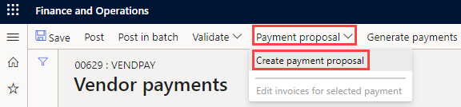
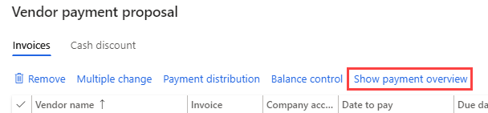
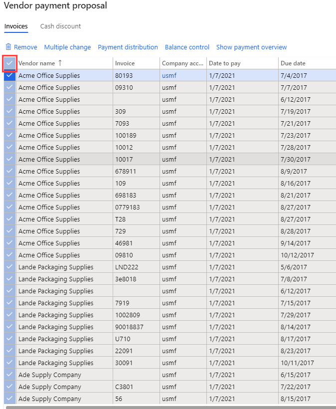
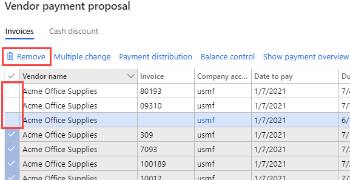

---
lab:
    title: 'Lab 2: Create a vendor payment journal'
    module: 'Module 2: Learn the Fundamentals of Microsoft Dynamics 365 Finance'
---

## Lab 2 - Create a vendor payment journal

## Objectives

Organizations that pay vendors on a recurring schedule can now automate the process of generating vendor payment proposals. Vendor payment proposal automations define the following details:

- When payment proposals are run
- What criteria are used to select the invoices that should be paid
- What vendor payment journal the resulting payments are saved in

Payment proposal automations don't automatically post the payments. Therefore, you can continue to use any validation and workflow processes that you currently use to approve the payments that are created.

Create a new vendor payment journal entry and payment proposal.

## Lab Setup

   - **Estimated Time**: 10 minutes

## Instructions

1. On the Finance and Operations Home page, in the top right, verify you are working with the USMF company.

1. If necessary, select the company and from the menu, select **USMF**.

1. In the left navigation pane, select **Modules** > **Accounts payable** > **Payments** > **Vendor payment journal**.

1. On the top menu, select **+ New**.

1. Notice the new Journal batch number that has been created.

1. In the **Name** box, enter **Vend,** and then select **VendPay** from the filtered list.

1. On the top menu, select **Lines**.

1. On the Vendor payments page, on the top menu, select **Payment proposal** > **Create payment proposal**.  
    The payment proposal is a query used to select invoices for payment. You can edit the list of invoices to pay before creating or generating the vendor payments.

    

1. In the Vendor payment proposal pane, under **INVOICE SELECTION CRITERIA**, select the **Select invoice by** menu, review the available options, and then select **Due date**.

1. In the **From date** and **To date**, delete any existing value. For this exercise, these date ranges will be left blank.

    >[!NOTE] A minimum payment date may be used as the payment date. The minimum payment date will be the earliest date used when creating payments. For example, if an invoice has a due date after the minimum payment date, the due date will become the payment date instead of the minimum payment date to pay the invoice on the latest possible date.

1. Expand **Records to include** and then review the options.  
    The filter is often used to restrict the invoices selected for payment by vendor group or method of payment. For example, you may add a filter to only pay invoices by check in this pay run.

1. Expand **Advanced parameters** and then review the available options.  
    The additional parameters can be used to define the payment currency or to enable centralized payments for this pay run.

1. Select **OK**.  
    After selecting OK, the results of the query will appear. If you don't want to preview the list of invoices selected to pay, you can go back to the Parameters fast tab and change the setting **Create payments without invoice preview** to **Yes**.

1. In the Vendor payment proposal window, select **Show payment overview** to view the payments that will be created for the vendor on the selected invoice.

    

1. On the menu, select **Hide payment overview** to hide the payments.

1. Select the check mark icon to the left of the **Vendor name** column heading to select all the invoices.

    

1. Clear the check box for the first three invoices, and then, on the menu, select **Remove** to remove all other invoices.

    

1. In the dialog box, select **Yes**.

1. Review the remaining three invoices.

1. To export the list of invoices to Excel, right-click the grid and select an export option.

1. In the lower right corner, select **Create payments** to create the vendor payments in the payment journal.

1. Review the list of vendor payments.
