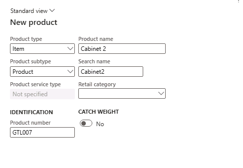
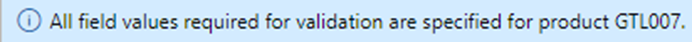

---
lab:
    title: 'Lab 1: Create a new product'
    module: 'Module 3: Learn the Fundamentals of Microsoft Dynamics 365 Supply Chain Management'
---

# Module 3: Learn the Fundamentals of Microsoft Dynamics 365 Supply Chain Management

## Lab 1: Create a new product

## Objective

In Contoso Entertainment System USA (USMF), you plan to purchase a new configuration of a cabinet from a vendor. You need to create an item to represent the new configuration. In this lab, you learn how to create a new item and item configurations.

## Lab Setup

   - **Estimated Time**: 10 minutes

## Instructions

In Contoso Entertainment System USA (USMF), you plan to purchase a new configuration of a cabinet from a vendor. You need to create an item to represent the new configuration.

1.  On the Finance and Operations Home page, in the upper right, verify you're working with the **USMF** company. If necessary, on the company drop-down, select **USMF**.

2.  In the upper left, select the **Expand the navigation pane** hamburger menu.

3.  In the navigation pane, select **Modules**, and then select **Product information management**. Then on the **Products** menu, select **Products**.

4.  On the **Products** page, in the upper menu, select **+ New**.

5.  In the **New product** page, in the **Product type** field, verify that **Item** is selected.

6.  In the **Product subtype** field, verify that **Product** is selected.

7.  Under **IDENTIFICATION**, in the **Product number** box, enter **GTL007**.

8.  In the **Product name** box, enter **Cabinet 2**.

    

9.  Select the **OK** button.

10. Under the **Product** menu in the Action Pane, select **Dimension groups** under the **Set up** group.

    

11. Select the **Storage dimension group** drop-down and select **SiteWH**.

12. Select the **Tracking dimension group** drop-down and select **None**.

13. Select the **OK** button.

14. Select the **Release products** button in the Action Pane to release the product in a legal entity.

15. A page opens displaying the first step as **Select products to release.**

    

16. Select the **Next** button at the bottom of the page

17. In the **Select companies to release to** page, select the **USMF** legal entity where the product should be released.

18. Select the **Next** button at the bottom of the page.

19. In the **Confirm selection** page, set the value of **Show Infolog upon failure** as **Yes** and **Run as batch** as **No.**

20. Select the **Finish** button at the bottom of the page.

21. In the navigation pane, select Modules, and then select Product information management. Then on the Products menu, select **Released** products.

22. In the **Releases** **products** page, locate the new item **GTL007** in the grid. 

23. Select the product link and navigate to the **Product details** page.

24. In the **General** FastTab, enter the following:

	- **Item model group**: FIFO

25. In the **Purchase** FastTab, enter the following:

	- **Unit**: ea

	- **Item sales tax group**: ALL

	- **Price**: 30

26. In the **Sell** FastTab, enter the following:

	- **Unit**: ea

	- **Item sales tax group**: ALL

	- **Price**: 35

27. In the **Manage inventory** FastTab, enter the following:

	- **Unit**: ea

28. In the **Engineer** FastTab, enter the following:

	- **BOM Unit**: ea

29. In the **Manage costs** FastTab, enter the following:

	- **Item group**: audio

30. To complete the configuration, select Product in the Action Pane. Select the Validate button under the Maintain group

    

31. Verify you're presented with the information banner confirming that all field values needed were validated.

    

32. Close all pages and return to the Home page.
