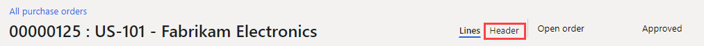
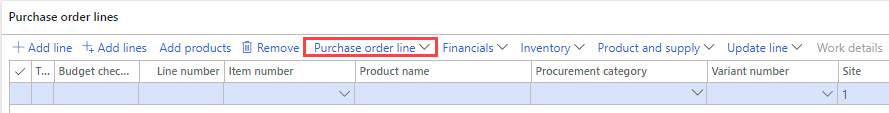

---
lab:
    title: 'Lab 2: Create a purchase order'
    module: 'Module 3: Learn the Fundamentals of Microsoft Dynamics 365 Supply Chain Management'
---

# Module 3: Learn the Fundamentals of Microsoft Dynamics 365 Supply Chain Management

## Lab 2: Create a purchase order

## Lab Setup

   - **Estimated Time**: 15 minutes

## Objective

It's more typical for purchase orders to be created automatically as result of master planning, direct delivery, and other processes. When created manually, a purchase order is usually created by a purchasing agent. Create a purchase order using the USMF company. 

## Lab Setup

   - **Estimated Time**: 10 minutes

## Instructions

1.  On the **Finance and Operations Home** page, in the top right, verify you are working with the **USMF** company. 

1.  If necessary, select the company, and from the menu, select **USMF**. 

1.  In the top left, select the **Expand the navigation pane** hamburger menu. 

1.  In the **Procurement and sourcing** module, select **Purchase orders** > **All purchase orders**. 

1.  On the **All purchase orders** page, in the action pane, select **+ New**. 

1.  In the **Create purchase order** pane, select the **Vendor account** field, and enter or select `US-101`

1.  When you select a vendor, details from the vendor record, such as address, invoice account, delivery terms, and delivery mode, will be copied as default values into the purchase order header. You can change these values if required. 

1.  Expand the **General** section. 

1.  Under **STORAGE DIMENSIONS**, select the **Site** menu, and review the list of sites. 

    > **Note:** The **Site** field, together with the **Warehouse** field, specifies where the procured goods or services must be delivered. The default delivery address is taken from the **Site**. Both fields can be populated with values set up for the selected vendor, or you can specify them manually. 

1.  For **Warehouse**, enter or select `13`

1.  Under **DATES**, the **Delivery date** field is used to specify when procured goods and services need to be delivered.

    > **Note:** You can specify a single delivery date for the order, or the individual order lines can be given unique delivery dates. If the delivery date specified here cannot be met for specific products or services because they have longer lead times, then those lines will be created with a later delivery date to accommodate for this.

1.  Expand the **Administration** section. The **Orderer** field can be used to specify who is placing the order. 

    > **Note:** This may be convenient to share with the vendor in case they need to contact that person. The value may be assigned automatically if the current user account is associated with a **Person** record on the **Users** page. 

1.  Select **OK**. 

1.  The order header has now been created. When you work with purchase order lines, only a summary of the header information is shown. If you need to view the rest of the information, select the **Header** tab. 

    

1.  Under **Purchase order lines**, in the toolbar, select the **Purchase order line** menu. 

    

1.  Under **DISPLAY**, select **Dimensions**. 

    > **Note:** Products can be in variants that are differentiated by dimensions, such as color, size, or style. Products can also be set up to use storage dimensions, such as site and warehouse. There are also optional tracking dimensions, such as batch and serial numbers. To improve the efficiency of order entry, you can add the dimension fields that you commonly use directly to the order grid. 

1.  In the **Dimensions display** pane, under **PRODUCT DIMENSIONS**, select **Color**. 

1.  *Optional:* If you select the **Save setup** toggle switch, the dimensions you have chosen will also be shown on the order line grid the next time you open the purchase order page. 

1.  Select **OK**. 

1.  Under **Purchase order lines**, select the **Item number** field, and select **T0004**. 

    > **Note:** Remember, you can also enter `T0004` in the **Filter** instead of scrolling through the list. 

    > **Note:** Order lines are created for products and services by specifying an **item number** or as expenses by specifying a **Procurement category**.
    > 
    > **Procurement category** is used for adding lines where procured items are expensed directly, rather than going into inventory. This means that if you need to expense a purchase, you can do this by creating a purchase order line that specifies a **Procurement category**, rather than creating a line with an **Item number**. Items can also be associated with a procurement category and in this case, the procurement category is shown as informational only. 

1.  Select the **Color** menu, review the available options, and then select one of the colors or color combinations. 

    > **Note:** **Site** and **Warehouse** are typically populated with values from the Purchase order header, but it is possible to override the fields if some lines need to be delivered to different locations. 

1.  In the **Quantity** field, enter `10` 

    > **Note:** The **Quantity** is automatically populated with the **Minimum order quantity** for the **product** if this is set up, or with a value of **1**. 
    >
    > Some additional information: 
    >
    >    - **Unit**: Indicates the unit of measure for the ordered quantity. Normally, the unit is automatically provided from the purchasing unit on the product master data. 
    >
    >    - **Unit price**: Contains a value from either a purchase agreement or a trade agreement. It is possible to change the unit price on individual order lines—for example, if a unique price is negotiated with the vendor. 
    >
    >    - **Discount**: Represents a discount amount per unit. This discount therefore reduces the unit price by the discount. This discount is commonly supplied automatically from purchase agreements or trade agreements, but it is possible to override on individual lines if unique discounts have been negotiated with the vendor. 
    >
    >    - **Discount percentage**: When entered, this reduces the net amount for the line accordingly. The discount percent is often supplied automatically from purchase agreements or trade agreements, but it is possible to override on individual lines if a unique discount percentage has been negotiated with the vendor. 
    >
    >    - **Net amount**: Calculated from other fields on the line, including quantity, unit price, discount, and discount percent. It is possible to change the Net amount, but then the Unit Price, Discount, and Discount percent fields will be blank, and when you post toward the line, the amount posted will be proportional to the net amount. Generally, the Net Amount field is only used for displaying the net amount of the line. 

1.  In the **Line details** FastTab, expand if necessary, and select the **Delivery** tab. 

1.  A unique **Delivery date** can be assigned to each order line. The date is inherited from the field on the Purchase order header, but you can change this. 

1.  Make a note of the **Purchase order number** and **close** the page. 

1.  On the **All purchase orders** list view, use the **Filter** to find your new purchase order. 

1.  When complete, **close** the **All purchase orders** page and return to the home page. 

