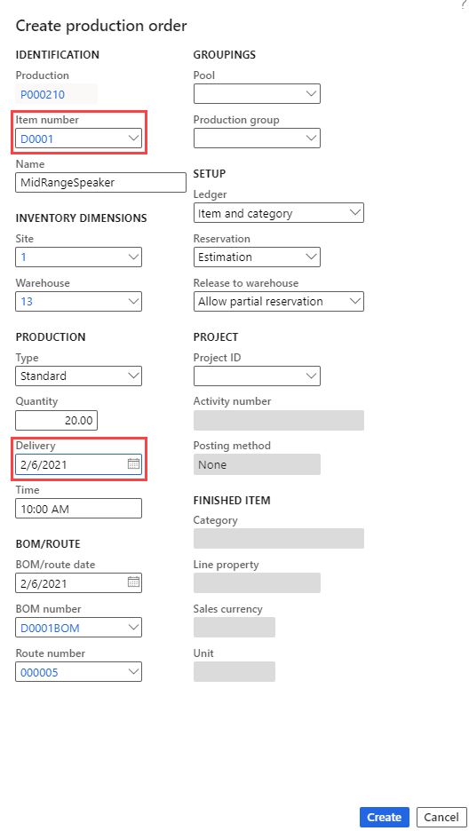

---
lab:
    title: 'Lab 4: Create a production order'
    module: 'Module 3: Learn the Fundamentals of Microsoft Dynamics 365 Supply Chain Management'
---

## Lab 4 - Create a production order

## Objectives

The production order contains information about what will be produced, the quantity to produce, and the planned finish date. It also contains information about which materials to consume and which process to follow to produce the item.

You must create a new production order for your company.

## Lab Setup

   - **Estimated Time**: 5 minutes

## Instructions

1. On the Finance and Operations Home page, in the top right, verify you are working with the USMF company.

1. If necessary, select the company and from the menu, select **USMF**.

1. In the left navigation pane, select **Modules** > **Production control** > **Production orders** > **All production orders**.

1. On the top menu, select **New production order**.

1. Under **IDENTIFICATION**, in the **Item number** box, enter **D0001,** and then select the identified item.

1. Under **PRODUCTION**, in the **Delivery** box, select a date one month from today's date.  
   
   The delivery date indicates when the production order should end in order to deliver on time. This date can be used in the scheduling process. For example, you can schedule the order backward from the delivery date. 

1. In the **Quantity** box, enter **20.00**.

1. Under **BOM/ROUTE**, the BOM number field automatically displays the number of any active BOM for the current item, but you can change the BOM for the production order by selecting an active BOM from the list of approved BOM versions. The Route number field automatically displays the number of any active Route for the current item, but you can change the Route for the production order by selecting an active Route from the list of approved Route versions.

    

1. Select **Create**.

1. **Close** the page and return to the home page.
